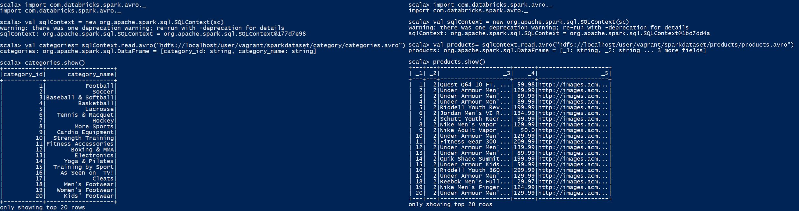

# Week-13
 
 # Output of 1d

# Output of 1e.
I have loaded a file named code.sh under code folder.
I have loaded a file named 'Result_0.txt' under Results folder, which displays the output upon filtering the products which's less than $100.

# Output of 1f.

I have loaded a file code.sh under code folder.
I have loaded a file named 'Result_1.txt' under Results folder.

# Output of 1g.
I have loaded a file named 'Result_2.avro' under Results folder
